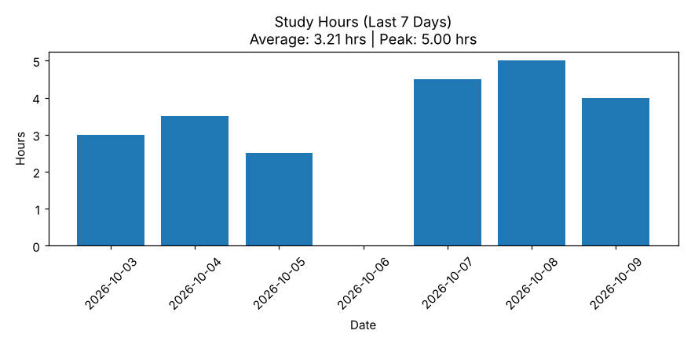

# StudyLog

A command-line study tracker in Python. Log hours by subject, see your totals, and chart the last seven days.


*The 7-day chart, generated from sample data.*

## Features

- Log study hours by subject; repeat entries on the same day add up
- Totals per subject and overall
- Bar chart of the last 7 days with the daily average and peak in the title (days with nothing logged show as 0)
- Weekly projection based on your 7-day average
- Everything is stored locally in a JSON file, created automatically on first run

## Usage

```bash
git clone https://github.com/Saarthi09/StudyLog.git
cd StudyLog
pip install -r requirements.txt
python study_tracker.py
```

```
1. Add Study Hours
2. View Statistics
3. Show Last 7 Days Graph
4. Weekly Prediction
5. Exit
Choose: 1
Subject: Math
Hours: 2
Added 2.0 hrs to Math for 2026-10-09.
Choose: 2

Study Summary

Math: 14.5 hrs
Physics: 8.0 hrs

Total Study Time: 22.5 hrs
```

## How data is stored

Sessions are saved to `Study_Tracker.json` in the folder you run the app from, grouped by date:

```json
{
    "2026-10-08": {
        "Math": 4,
        "Physics": 1
    },
    "2026-10-09": {
        "Math": 1.5,
        "Physics": 2.5
    }
}
```

The file is listed in `.gitignore`, so your own log stays on your machine.

## Tech

- Python 3: `json` and `datetime` from the standard library
- Matplotlib for the chart

## Project structure

```
.
├── study_tracker.py   # The app
├── requirements.txt   # matplotlib
├── docs/              # README images
└── README.md
```

## Ideas for next steps

- Weekly goals per subject, with progress shown on the chart
- A per-subject breakdown (stacked bars) instead of daily totals only
- Export the log to CSV
